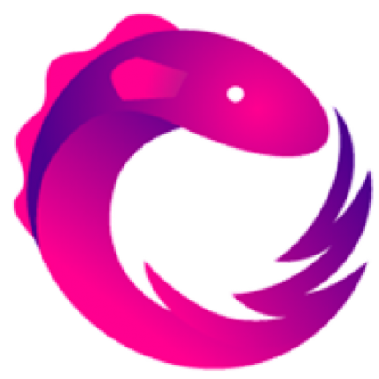

### Hi there 👋 and Welcome ;)

  <h1 align="center"><b>I'm  Android Developer</h1>

 

Passionate Web & Mobile Developer since 2017 using mostly Android, Java, Kotlin, React Native, ReactJS, Angular and little bit more others technologies.

Enthusiastic of Scrum & Agile.

 

**Languages and Tools:**  
 
<code></code>&nbsp;
<code></code>&nbsp;
<code></code>&nbsp;
<code></code>&nbsp;
<code></code>&nbsp;
<code></code>&nbsp;
<code></code>&nbsp;
<code></code>&nbsp;

- 🔭 I’m currently working on Android projects with Java, Kotlin, Jetpack Compose and others.
- 🌱 I’m currently learning Kotlin in deep.
- 👯 I’m looking to collaborate on ambituses projects.
<!--
**Pamento/Pamento** is a ✨ _special_ ✨ repository because its `README.md` (this file) appears on your GitHub profile.

Here are some ideas to get you started:
- 🤔 I’m looking for help with ...
- 💬 Ask me about ...
- 📫 How to reach me ? : on LinkedIn
- 😄 Pronouns: ...
- ⚡ Fun fact: ...
-->
